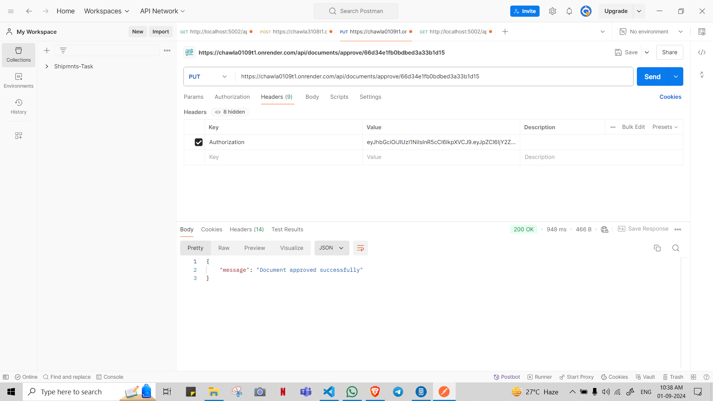

Passed the string after login and using that token which was response of login from user

Generating Token

Authorizing Token 

Successful Upload

If user with RoleB tried to upload 

Generating token for role b

Using token for role b

Access denied for role a

Build application with frontend and backend where you register a user and assign roles and permission to the user and based on roles display different view
 
Roles and Permission should be a Middleware in backend
 
Backend should be service driven architecture and preferably a microservice approach.
 
2 roles and permission based role.
 
i. Role A uploads a document
 
ii. Role B approves the uploaded document after viewing
 
Tech Stack: MERN – Typescript/Javascript